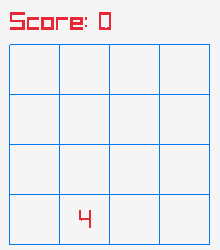
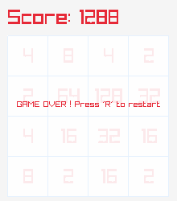
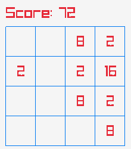

# 2048im

Improved version of 2048 game made with raylib

## Milestones

- [x] Fully functional classic version
- [ ] Beautiful menu and animations
- [ ] Improved Version
- [ ] Online Scoreboard

## Screenshots





## Setting up
Native builds:
```sh
$ meson setup build
# compile with
$ meson compile -C build
```

Web builds:
```sh
$ meson setup --cross-file cross-file/web.ini build/web
# compile with
$ meson compile -C build/web
```

Cross-compiled Windows builds using [MinGW](http://mingw.org):
```sh
$ meson setup --cross-file cross-file/windows32.ini build/win32
# compile with
$ meson compile -C build/win32
```
